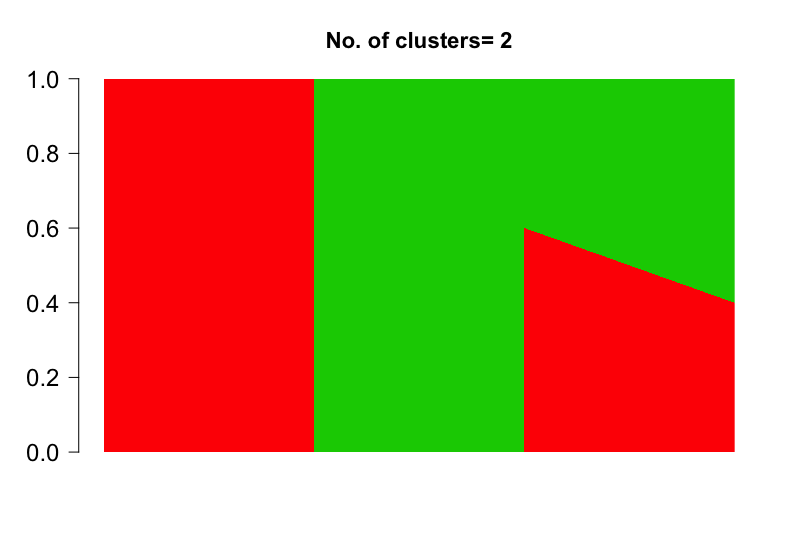
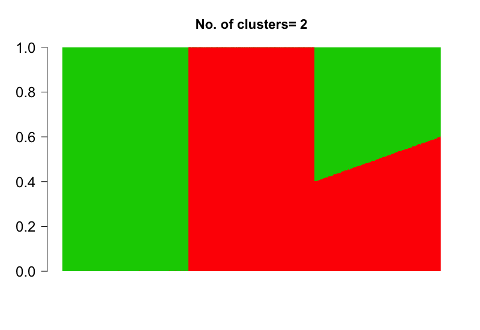

```{r knitr, echo=FALSE, results="hide"}
library("knitr")
library(kableExtra)
opts_chunk$set(tidy=FALSE,tidy.opts=list(width.cutoff=30),dev="png",fig.show="hide",
               fig.width=4,fig.height=7,
               message=FALSE, warning = FALSE)
```


```{r style, eval=TRUE, echo=FALSE, results='asis'}
BiocStyle::markdown()
```


# Introduction

We present a Grade of Membership model for clustering samples based on the epigenetic data tracking the number of methylated and unmethylated CpG/GpC/hCh sites in genomic bins of fixed sizes across the genome. This is a companion package to the package **CountClust** [@Dey2017] designed to detect clusters based on gene expression patterns in single cells or bulk samples. 
In this model, we assume that each epigenetic mark in the genome comes from a specific methylation profile. However the data is recorded not at the level of a single site but rather as counts of methylated and non-methylated sites in genomic bins of fixed size. As a result, our methylation profiles will capture differences at best at the scale of a genomic bin. 

# methClust Installation

**methClust** requires the following R packages - `r CRANpkg("slam")`, `r CRANpkg("SQUAREM")`,
and the Bioconductor package `r Biocpkg("CountClust")` for visualization using the Structure
plot representation. Also **methClust** uses the package skeleton structure due to Matt Taddy's package `r CRANpkg("maptpx")` [@Taddy2012]. 

```{r install_countclust_github, eval=FALSE}
install_github('kkdey/methClust')
```


Then load the package with:

```{r load_countclust, cache=FALSE, eval=TRUE,warning=FALSE}
library(methClust)
```

# Model

First we present the underlying modeling framework of **methClust**. The basic algorithm is an EM algorithm which can be either accelerated using active set strategies or using SQUAREM acceleration [@Varadhan2004].

Consider a bisulfite sequencing experiment that records the number of methylated and 
unmethylated sites per bin across the genome. The number of methylated CpG/hCh sites in each bin $b$ of sample $n$ is assumed to follow a Binomial distribution. 

$$ M_{nb} \sim Bin \left (Y_{nb} = M_{nb} + U_{nb} , p_{nb} \right ) $$

where $M_{nb}$ and $U_{nb}$ denote the number of methylated and unmethylated  sites 
in bin $b$ and for sample $n$ respectively. $p_{nb}$ represents the probability of methylation, and under the Grade of Membership model assumption, $p_{nb}$ is assumed to have a lower dimensional representation. 

$$ p_{nb} = \sum_{k=1}^{K} \omega_{nk} g_{kb}  $$

$\omega_{nk}$ represents the grades of membership of the $n$th sample in the $k$th methylation profile and $g_{kb}$ represents the probability of methylation in bin $b$ for the $k$th methylation profile.Note that here we assume for each cluster that the probability of methylation is same for all methylation sites in a particular bin. As a results, clusters only separate out at the scale of the genomic bins.

Intuitively we assume that each bin comprises of  methylations coming from one of the $K$ methylation profiles or clusters in the grade of membership model. 

For each CpG site $s$ in sample $n$, we define a latent variable $Z_{nks}$ to be an indicator variable for cluster/profile $k$. 

$$ Pr (Z_{nks} = 1 ) = \frac{\omega_{nk} g_{k, b(s)}}{\sum_{l} \omega_{nl} g_{l, b(s)}}  = p_{nk,b(s)}$$

where $b(s)$ denotes the bin the site $s$ belongs to.

Denoting by $Y_{nb}$ the total number of sites in the bin $b$, we write 

$$ Y_{nb} = Y_{n1b} + Y_{n2b} + \cdots + Y_{nKb} $$

where 

$$ Y_{nkb} = M_{nkb} + U_{nkb} $$

is the total number of hCh sites in bin $b$ and sample $n$ that are assigned to the $k$ th methylation profile. 

Given $Y_{nkb}$, the number of methylated sites in cluster $k$ in sample $n$ and bin $b$, namely $M_{nkb}$ follows a Binomial distribution. 

$$ M_{nkb} | Y_{nkb}  \sim Bin (Y_{nkb}, g_{kb} ) $$

$$ \left( Y_{n1b}, Y_{n2b}, \cdots, Y_{nKb} \right ) \sim Mult \left (Y_{nb} ; \omega_{n1}, \omega_{n2}, \cdots, \omega_{nK} \right )  $$

One can show that

$$E \left ( M_{nkb} | Y_{nb}  \right) = E \left( \left (M_{nkb} | Y^{(t)}_{nkb} \right) | Y_{nb} \right )  = E \left ( Y_{nkb} g^{(t)}_{kb} | Y_{nb} \right )  = Y_{nb} \omega^{(t)}_{nk} g^{(t)}_{kb} $$


But we would like to compute $ E(M_{nkb} | M_{nb} ) $

We know that 

$$ \sum_{k} E(M_{nkb} | M_{nb} ) = M_{nb} $$

$$ E \left( M_{nb} | Y_{nb} \right) = \sum_{k=1}^{K} E \left ( M_{nkb} | Y_{nb}  \right) = Y_{nb} \sum_{l} \omega^{(t)}_{nl} g^{(t)}_{lb} $$

$$ A^{(t)}_{nkb} = E \left (M_{nkb} | M_{nb}, Y_{nb} \right ) = M_{nb} \frac{\omega^{(t)}_{nk} g^{(t)}_{kb}}{\sum_{l} \omega^{(t)}_{nl} g^{(t)}_{lb} } $$

Similarly one can show that 

$$  B^{(t)}_{nkb} = E \left (U_{nkb} | U_{nb}, Y_{nb} \right ) = U_{nb} \frac{\omega^{(t)}_{nk} (1 - g^{(t)}_{kb})}{\sum_{l} \omega^{(t)}_{nl} (1 - g^{(t)}_{lb}) }  $$


Assume  now $M_{nkb}$ and $U_{nkb}$ are the latent variables in the EM algorithm. Then the EM log-likelihood is given by 

\begin{eqnarray}
E_{L | Data} \left [ \log Pr (Data, L | Param) \right ] & = \sum_{n, b} \sum_{k} E_{U_{nkb}, M_{nkb} | M_{nb}, U_{nb}, \omega, g} \left [ \log Pr (U_{nkb}, M_{nkb}, M_{nb}, U_{nb} | \omega, g \right ]  \\
& \propto \sum_{n, b} \sum_{k}  A^{(t)}_{nkb} \times \log(\omega_{nk} g_{kb} )  + B^{(t)}_{nkb} \times \log (\omega_{nk} (1 - g_{kb} ) )    \\
& \propto \sum_{n, b} \sum_{k} \log(\omega_{nk}) (A^{(t)}_{nkb} + B^{(t)}_{nkb} ) + \log(g_{kb}) A^{(t)}_{nkb} + \log(1- g_{kb}) B^{(t)}_{nkb} \\
\end{eqnarray}

Optimizing for $\omega^{(t+1)}_{nk}$ under the constraint that $\sum_{k=1}^{K} \omega^{(t+1)}_{nk} = 1$, we get 

$$ \omega^{(t+1)}_{nk} = \frac{\sum_{b} (A^{(t)}_{nkb} + B^{(t)}_{nkb} )} {\sum_{l}\sum_{b} (A^{(t)}_{nlb} + B^{(t)}_{nlb} )} = \frac{1}{Y_{n+}} \sum_{b} (A^{(t)}_{nkb} + B^{(t)}_{nkb}) $$

where $Y_{n+}$ is the total number of sites for sample $n$.

Similarly, we can get the estimates for $g^{(t+1)}_{kb}$ as 

$$ g^{(t+1)}_{kb} = \frac{\sum_{n} A^{(t)}_{nkb}} {\sum_{n} (A^{(t)}_{nkb} + B^{(t)}_{nkb} )} $$

# Implementation

We now discuss the implementation of the model. 

- Initialize the parameters of the model $\omega^{(0)}_{nk}$ and $g^{(0)}_{kb}$ . We draw a random subset of samples to define a cluster and compute $g^{(0)}$ values based on the mean frequency of methylation of the samples in each of the clusters. The corresponding $\omega^{(0)}$ values are computed from the linear regression of 

$$ log \left (\frac{M_{nb}}{U_{nb} + M_{nb}} \right ) = \omega_{N \times K}g^{(0)} _{K ]\times B} + \epsilon $$
which we solve to estimate $\omega^{(0)}$.

We then use the $g^{(0)}$ and $\omega^{(0)}$ values as starting points to a methClust model fit on a small sample training data to get refined estimates $g^{(1)}$ and $\omega^{(1)}$, which then form the starting points of the EM algorithm.

- Given $g^{(t)}$ and $\omega^{(t)}$, the values of the parameters at time $t$, we define 

$$ A^{(t)}_{nkb} = M_{nb} \frac{\omega^{(t)}_{nk} g^{(t)}_{kb}}{\sum_{l} \omega^{(t)}_{nl} g^{(t)}_{lb} }  \hspace{2 cm} B^{(t)}_{nkb} = U_{nb} \frac{\omega^{(t)}_{nk} (1 - g^{(t)}_{kb})}{\sum_{l} \omega^{(t)}_{nl} (1 - g^{(t)}_{lb}) }  $$

- Compute new parameter estimates $\omega^{(t+1)}$ and $g^{(t)}$ as follows 

$$ \omega^{(t+1)}_{nk} \propto \sum_{b} (A^{(t)}_{nkb} + B^{(t)}_{nkb})  \hspace{2 cm}  g^{(t+1)}_{kb} = \frac{\sum_{n} A^{(t)}_{nkb}} {\sum_{n} (A^{(t)}_{nkb} + B^{(t)}_{nkb} )}$$

- We provide options to assume a slight prior on $\omega$ 

$$ (\omega_{n1}, \omega_{n2}, \cdots, \omega_{nK}) \sim Dir \left ( \frac{1}{K}+1, \frac{1}{K} + 1, \cdots, \frac{1}{K}+ 1 \right ) $$

which changes the EM updates for $\omega$ only slightly

$$ \omega^{(t+1)}_{nk} \propto \sum_{b} \left (A^{(t)}_{nkb} + B^{(t)}_{nkb} + \frac{1}{K} \right ) $$


- We employ an acceleration on top the regular EM updates. For acceleration, we may use the SQUAREM method to perform Quasi-Newton acceleration. However, we employ a faster active set strategy, as proposed by Taddy 2012 [@Taddy2012]. To perform this, we compute the gradient and the Hessian (curvature) of the log posterior function with respect to the $\omega$ parameters (prior assumed to be same as above). 

$$ \nabla (\omega_{nk}) =  \sum_{b=1}^{B} \frac{M_{nb} g_{kb}}{\sum_{l} \omega_{nl} g_{lb}} - \sum_{b=1}^{B} \frac{U_{nb} g_{kb}}{\sum_{l} \omega_{nl} (1 - g_{lb})} + (1/K \omega_{nk})$$
$$ Hess(\omega_{nk}, \omega_{nh}) = H_{kh} =  - \sum_{b=1}^{B} \frac{M_{nb} g_{kb}g_{hb}}{\left(\sum_{l} \omega_{nl} g_{lb} \right)^2} - \sum_{b=1}^{B} \frac{U_{nb} g_{kb}g_{hb}}{\left (\sum_{l} \omega_{nl} (1 - g_{lb}) \right)^2} + \mathbb{I}_{k=h} (1/K \omega^2_{nk})$$

We solve for the equation for each $n$

$$ -H \Delta_{n} + \lambda_{n} = \nabla_{n}  \hspace{1 cm} 1^{T} \Delta_{n} = 0 $$
where $\Delta_{nk} = \omega_{nk} - \omega^{(t+1)}_{nk}$ where $\omega^{(t+1)}_{nk}$ is the update from the EM algorithm step above. We solve this using active set strategy with the solution for $\Delta$ obtained from above equation. This results in a new update $\omega^{(t+1)}$ that satisifies 

$$ \omega^{(t+1)}_{nk} \leftarrow  \omega^{(t+1)}_{nk} + \delta_{n} \Delta_{n} $$

where $\delta_{n}$ is the maximum value that satisfies $\delta_{n} \Delta_{nk} < - \omega^(t)_{nk}$ for all $k$. 

We have found this strategy to accelerate the speed of convergence compared to the regular EM updates.

- We track the log  posterior 

$$ \log \mathbf{L} (M, U, \omega, g)  = \sum_{nb} M_{nb} \log \left (\sum_{k} \omega_{nk}g_{kb} \right) + \sum_{n,b} U_{nb} \log \left (\sum_{k} \omega_{nk}(1 - g_{kb}) \right)  + \frac{1}{K} \log (\omega_{nk}) + C $$
at each step and take the difference between log posteriors between each successive steps

$$ diff (t) = \log \mathbf{L} (M, U, \omega^{(t+1)}, g^{(t+1)}) - \log \mathbf{L} (M, U, \omega^{(t)}, g^{(t)}) $$


This difference will eventually tend to $0$ as the algorithm converges, so we set a tolerance `tol` so that the algorithm stops if at step $t$, $diff(t)$ becomes lower than `tol`.


# Example

Here we present a small demo of how **methClust** can be used to fit a Grade of Membership model on a simulated example. This example will be replaced with a more appropriate real example with the further development of this package.

We first define the grades of membership matrix $\omega_{N \times K}$ where $N$ is the number of samples and $K$ is the number of clusters

```{r eval=TRUE, warning=FALSE, fig.align="center", fig.show="asis", dpi=144, fig.width=7, fig.height=5, out.width="7in", out.height="5in"}
n.out <- 500
omega_sim <- rbind( cbind( rep(1, n.out), rep(0, n.out)),
                    cbind( rep(0, n.out), rep(1, n.out)),
                    cbind( seq(0.6, 0.4, length.out = n.out),
                           1- seq(0.6, 0.4,length.out=n.out)) )

K <- dim(omega_sim)[2]
barplot(t(omega_sim),
        col = 2:(K+1),
        axisnames = F, space = 0,
        border = NA,
        main=paste("No. of clusters=", K),
        las=1, ylim = c(0,1), cex.axis=1.5,cex.main=1.4)

```



Next we define the cluster profiles $f_{K \times B}$ where $ 0 \leq f_{kb} \leq 1$ and $B$ denotes the number of genomic bins that the genome has been partitioned into.

```{r}
m.out <- 200
freq_sim <- cbind(c(rep(0.8, m.out), rep(0.2, m.out), rep(0.5, m.out), rep(0.01, m.out)),
                  c(rep(0.01, m.out), rep(0.01, m.out), rep(0.5, m.out), rep(0.8, m.out)))

```

We next define matrices for the number of methylated sites $M$ and unmethylated sites $U$ per sample annd per bin, which are assumed to obey Equation 1.

```{r}
prob <- omega_sim %*% t(freq_sim)
Y <- matrix(rpois(dim(prob)[1]*dim(prob)[2], 1000), dim(prob)[1], dim(prob)[2])

M <- matrix(0, dim(Y)[1], dim(Y)[2])

for(m in 1:dim(Y)[1]){
  for(n in 1:dim(Y)[2]){
    M[m,n] <- rbinom(1, Y[m,n], prob = prob[m,n])
  }
}

U = Y - M

```

We now fit the \textit{meth_topics} function in **methclust** taking the matrices of the counts of methylated sites and unmethylated sites across the genomic bins for each sample and $K$ as in the number of clusters.

```{r echo=TRUE, eval=TRUE}
topics <- meth_topics(M, U, K=2, tol = 10, use_squarem = FALSE)
```

the `use_squarem = FALSE` option uses the active set strategy due to Taddy et al 2012 [@Taddy2012], while the `use_squarem=TRUE` uses the SQUAREM implementation [@Varadhan2004] which has been found to be slighlt slower in comparison. \textit{tol} indicates the threshold for the difference in posterior in consecutive iterations of the EM algorithm.

The output \textit{topics} is a list consisting of the fitted $\omega$ and $freq$ matrices, as well as the the log posterior of the resulting fit.

```{r}
topics$omega[1:2,]
topics$theta[1:2,]
topics$L
```

The estimated grades of membership matrix `topics$omega` was observed to match 
the true grade of membership matrix `omega_sim` closely, thereby serving as a validation 
of the model implementation.


```{r eval=TRUE, warning=FALSE, fig.align="center", fig.show="asis", dpi=144, fig.width=7, fig.height=5, out.width="7in", out.height="5in"}
barplot(t(topics$omega),
        col = 2:(K+1),
        axisnames = F, space = 0,
        border = NA,
        main=paste("No. of clusters=", K),
        las=1, ylim = c(0,1), cex.axis=1.5,cex.main=1.4)
```



# References


